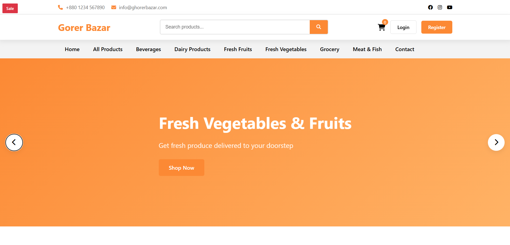
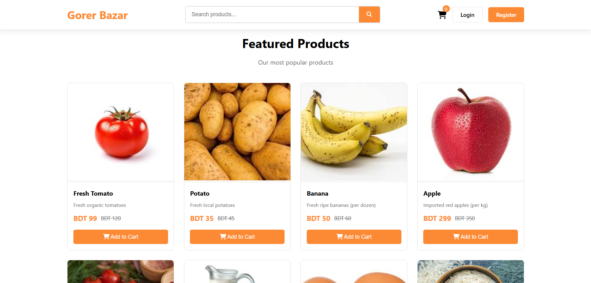
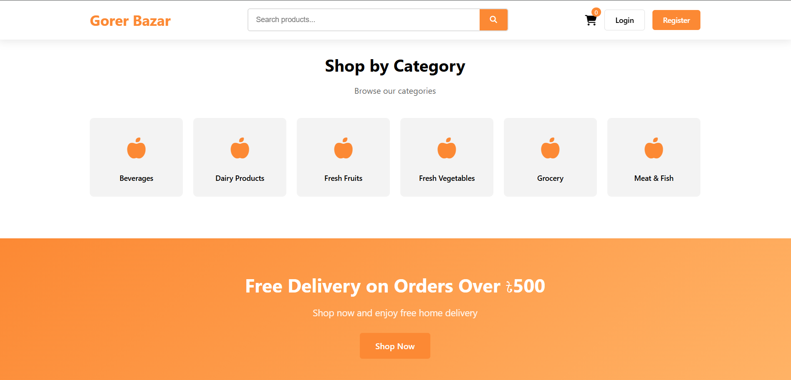
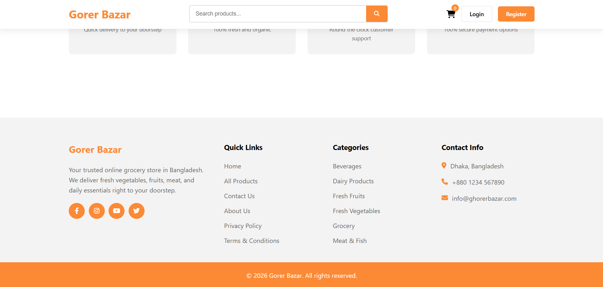
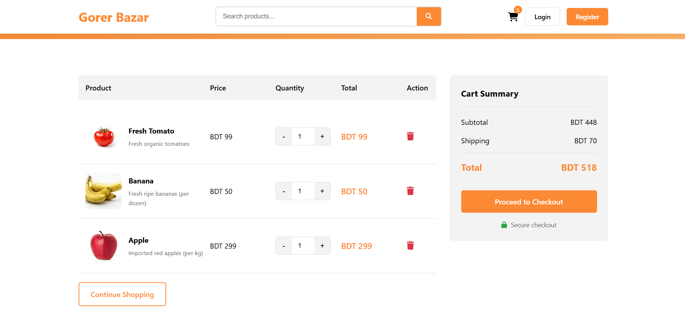
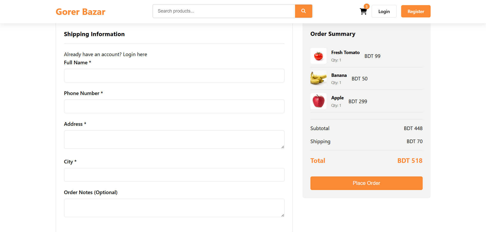
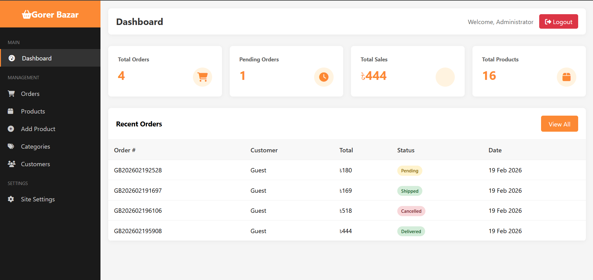
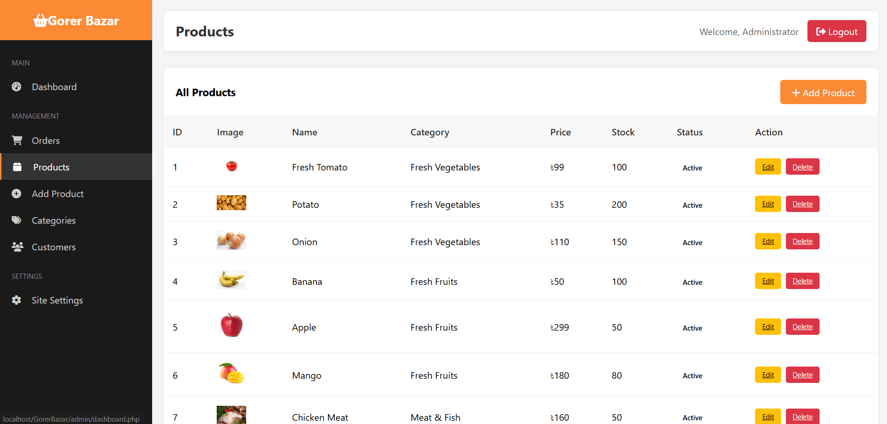
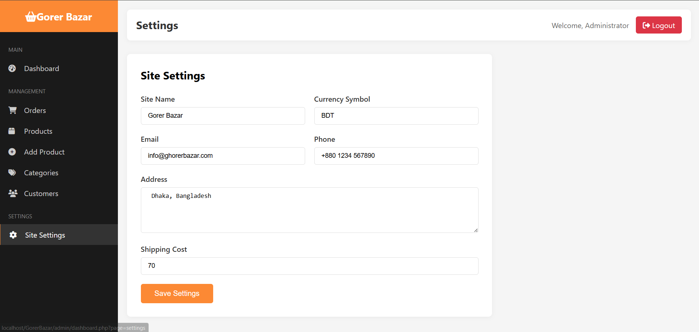

# Ghorer Bazar - E-Commerce Website

A complete PHP/MySQL e-commerce website similar to ghorerbazar.com with full admin panel control.

## Features

- **Frontend**
  - Responsive design (mobile, tablet, desktop)
  - Product catalog with categories
  - Shopping cart functionality
  - Checkout with Cash on Delivery
  - User registration/login
  - Search functionality
  - Featured products section

- **Admin Panel**
  - Dashboard with sales overview
  - Order management
  - Product management (add/edit/delete)
  - Category management
  - Customer management
  - Site settings

## Installation

1. **Start XAMPP**
   - Start Apache and MySQL services in XAMPP Control Panel

2. **Setup Database**
   - Open phpMyAdmin (http://localhost/phpmyadmin)
   - Create a new database named `ghorer_bazar`
   - Import the `database.sql` file

3. **Configure**
   - Edit `config/database.php` if needed (database credentials)

4. **Run the Website**
   - Open http://localhost/GorerBazar/ in your browser
   - Admin panel: http://localhost/GorerBazar/admin/
   - Admin Login: username: `admin`, password: `admin123`

## File Structure

```
GorerBazar/
├── admin/             # Admin panel
│   ├── pages/         # Admin pages
│   ├── dashboard.php  # Main dashboard
│   ├── index.php      # Admin login
│   └── logout.php
├── ajax/              # AJAX handlers
├── config/            # Configuration
├── css/               # Stylesheets
├── images/            # Product images
│   └── products/
├── inc/               # Includes
│   ├── header.php
│   ├── footer.php
│   └── functions.php
├── js/                # JavaScript files
├── admin/             # Admin panel
├── index.php          # Homepage
├── products.php       # All products
├── product.php        # Product details
├── category.php       # Category page
├── cart.php           # Shopping cart
├── checkout.php       # Checkout page
├── login.php          # User login
├── register.php       # User registration
├── search.php         # Search results
├── contact.php        # Contact page
├── my-account.php     # User account
├── order-success.php  # Order confirmation
├── database.sql       # Database schema
└── setup.php         # Database setup script
```

## Admin Credentials

- **URL**: http://localhost/GorerBazar/admin/
- **Username**: admin
- **Password**: password

## Technology Stack

- PHP 7+
- MySQL
- HTML5/CSS3
- JavaScript/jQuery
- Font Awesome Icons
- Responsive Design

## Customization

- Edit `admin/pages/settings.php` to change site name, phone, email, etc.
- Add product images to `images/products/` folder
- Modify colors in `css/style.css` (--primary-color: #fc8934)

## License

This code is provided for educational purposes.

## Output User View







## Admin Dashboard View




